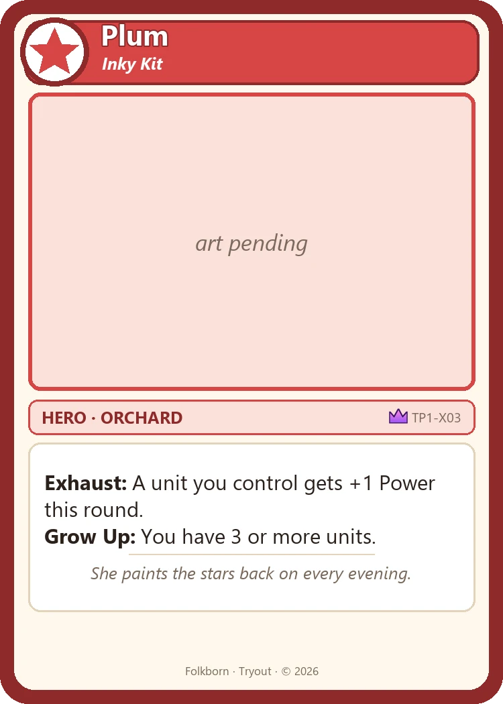
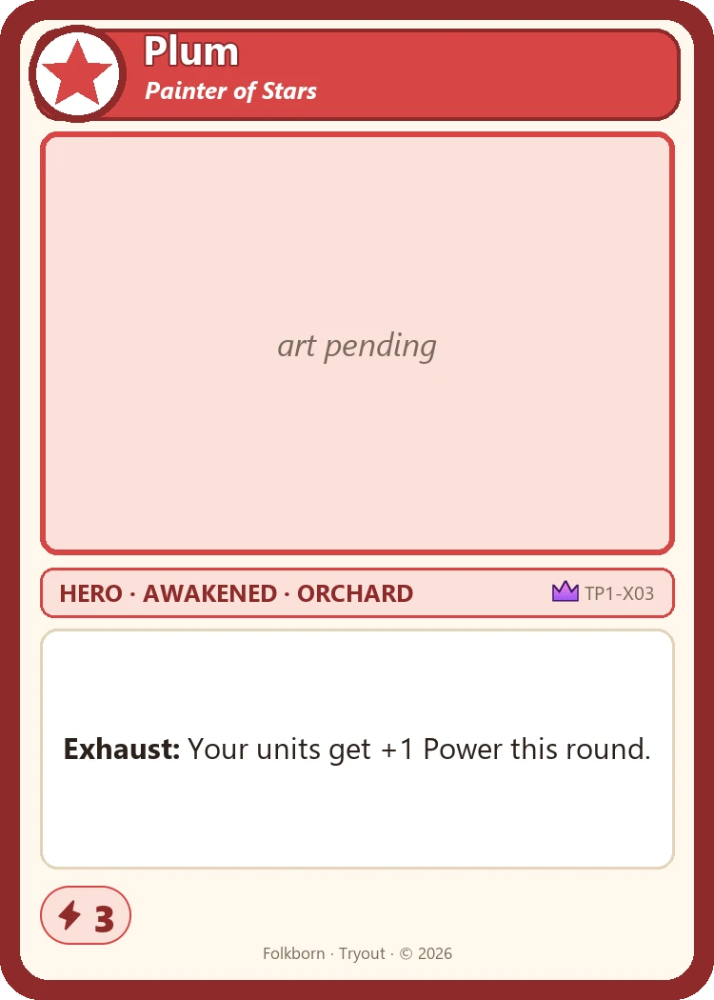
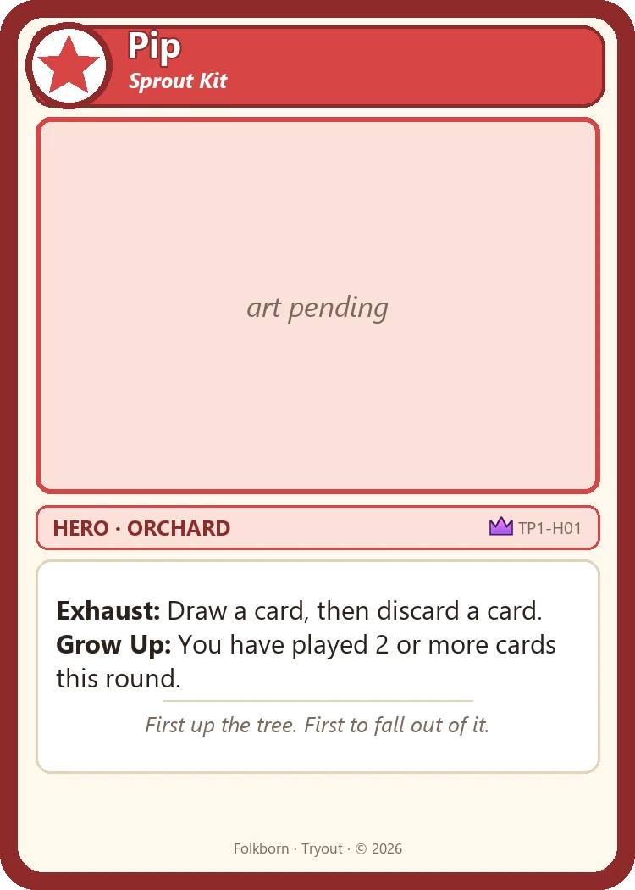
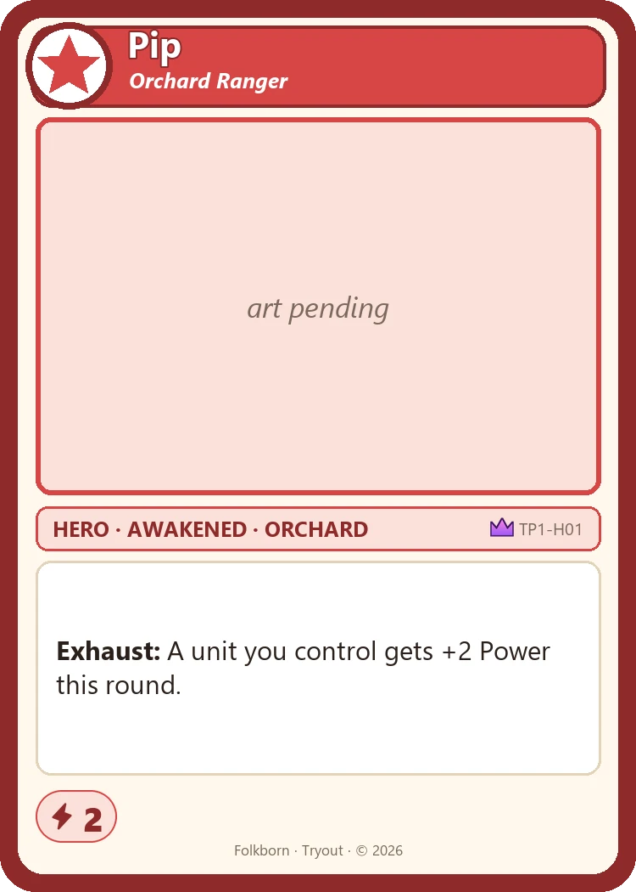
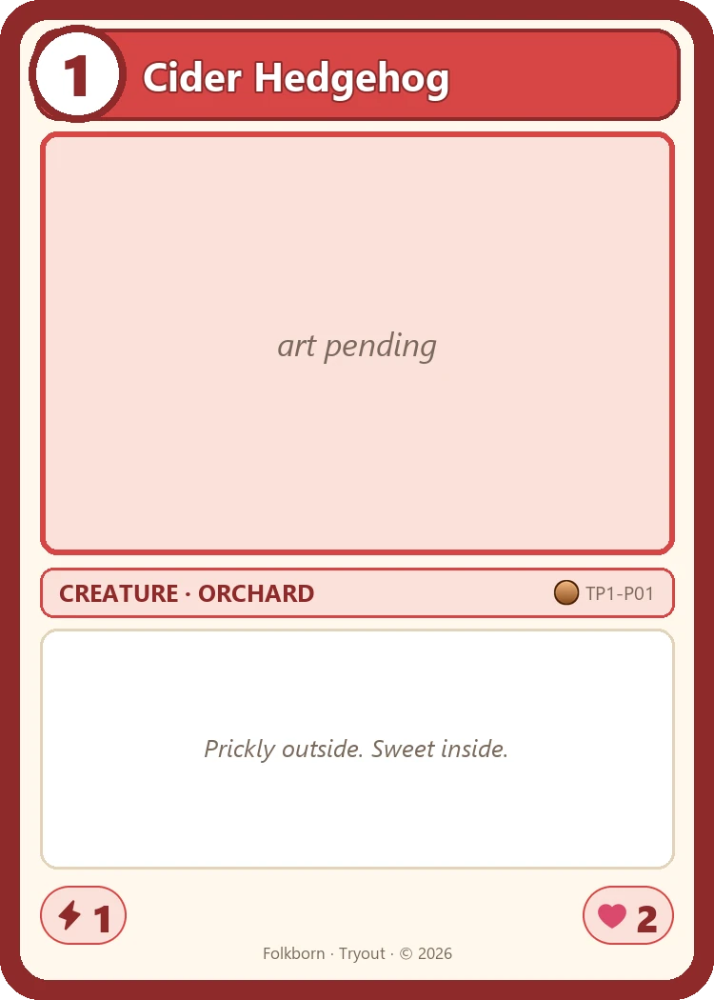
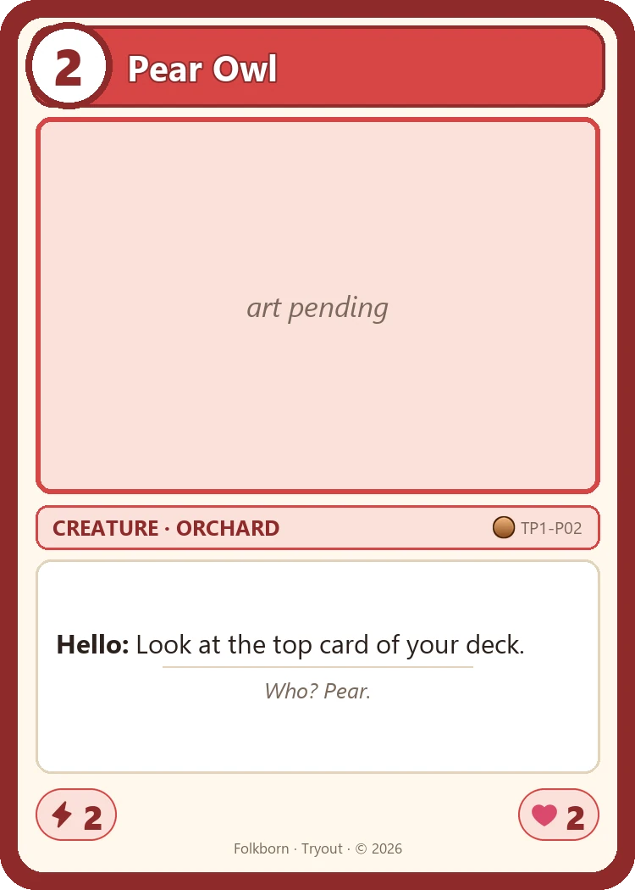
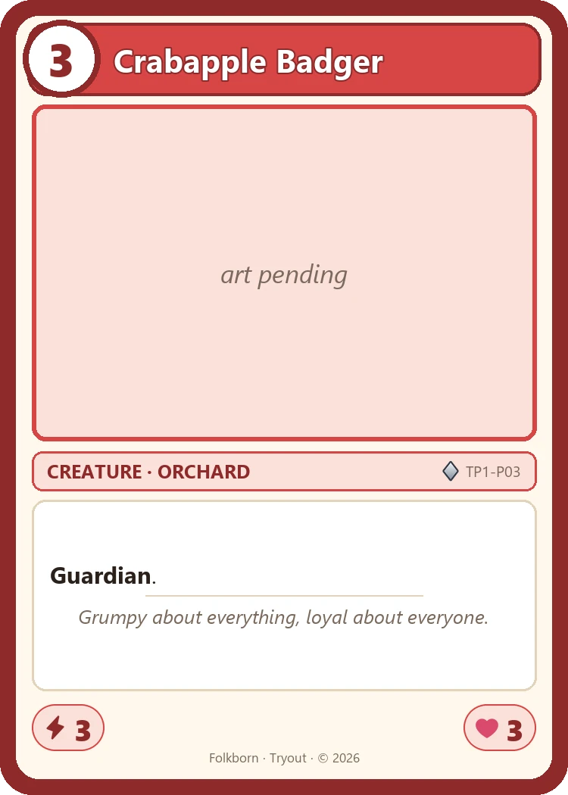
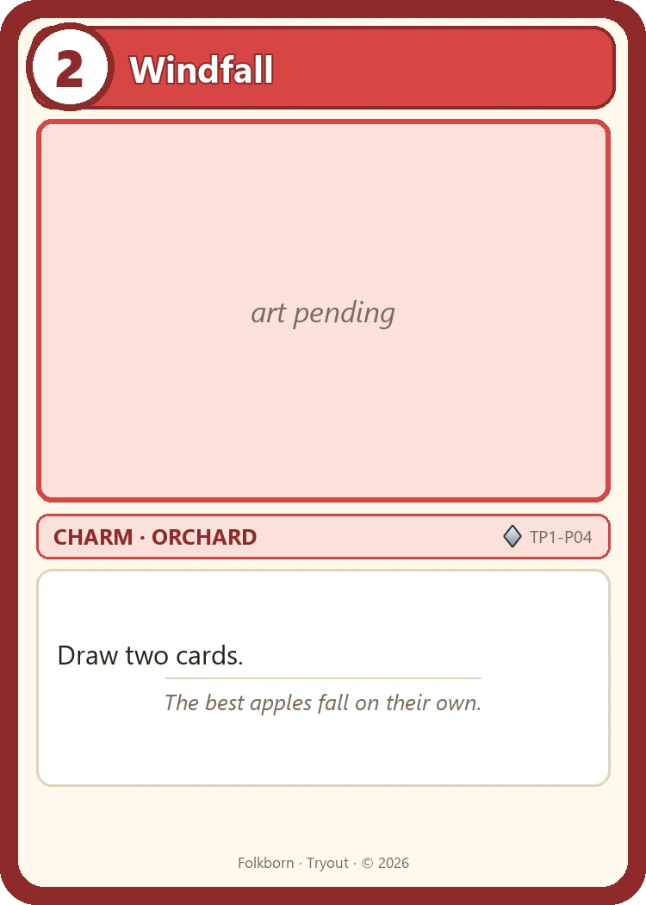
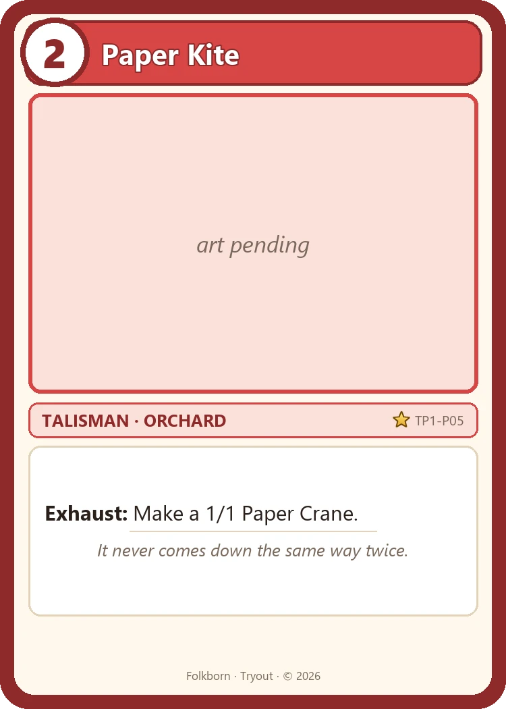

# Tryout (TP1) — card images

Generated by `tools/generate_art.py` (art) and `tools/compose_cards.py` (frames and text).

## Plum, the Night Painter — the mightiest Hero

The only Awakened Hero with 3 Power and Fierce.

<table>
<tr><td align="center"> <b>Plum, Inky Kit (Kitten)</b> TP1-X03-kitten</td><td align="center"> <b>Plum, Painter of Stars (Big Cat)</b> TP1-X03-bigcat</td></tr>
</table>

## All Heroes

Each Hero starts on its first side and Awakens into its second. Pip, the Apple Scout.

<table>
<tr><td align="center"> <b>Pip, Sprout Kit (Kitten)</b> TP1-H01-kitten</td><td align="center"> <b>Pip, Orchard Ranger (Big Cat)</b> TP1-H01-bigcat</td></tr>
</table>

## Tryout Orchard deck (led by Pip, the Apple Scout)

<table>
<tr><td align="center"> <b>Cider Hedgehog</b> TP1-P01 ×3</td><td align="center"> <b>Pear Owl</b> TP1-P02 ×3</td><td align="center"> <b>Crabapple Badger</b> TP1-P03 ×3</td><td align="center"> <b>Windfall</b> TP1-P04 ×3</td></tr>
<tr><td align="center"> <b>Paper Kite</b> TP1-P05 ×3</td></tr>
</table>

## Garden (in both decks)

<table>

</table>
