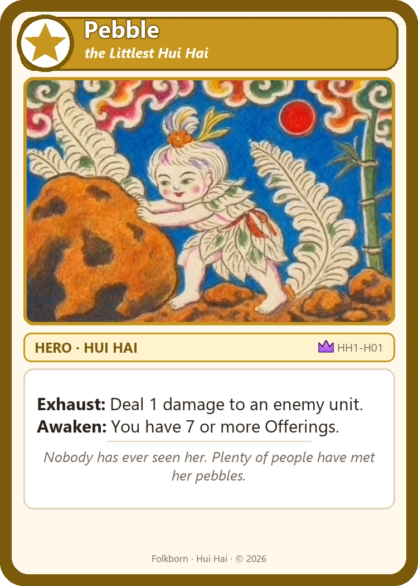
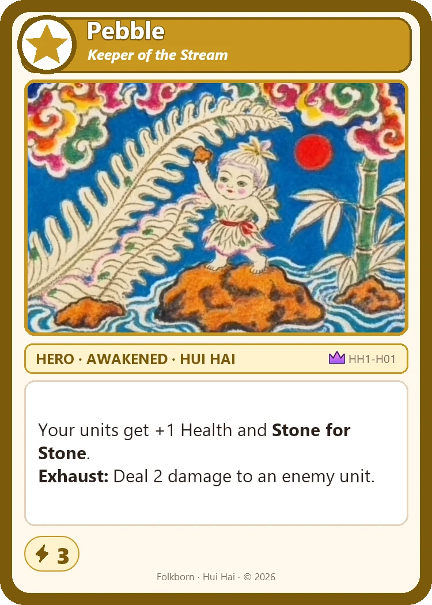

# Hui Hai (HH1) — card images

Generated by `tools/generate_art.py` (art) and `tools/compose_cards.py` (frames and text).

## Pebble, the Littlest Hui Hai — the mightiest Hero

The only Awakened Hero with 2 Power and Fierce.

<table>
<tr><td align="center"> <b>Pebble, the Littlest Hui Hai (Kitten)</b> HH1-H01-kitten</td><td align="center"> <b>Pebble, Keeper of the Stream (Big Cat)</b> HH1-H01-bigcat</td></tr>
</table>

## All Heroes

Each Hero starts on its first side and Awakens into its second. .

<table>

</table>

## Garden (in both decks)

<table>

</table>
