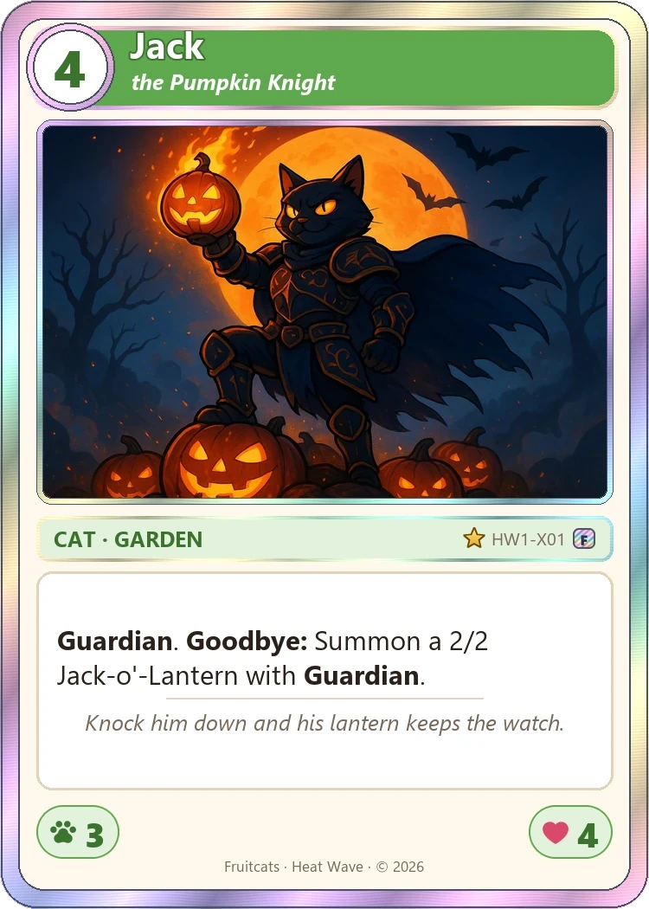
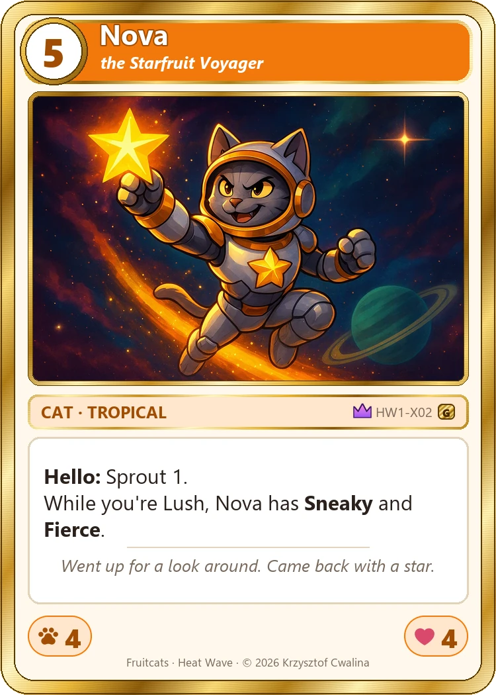
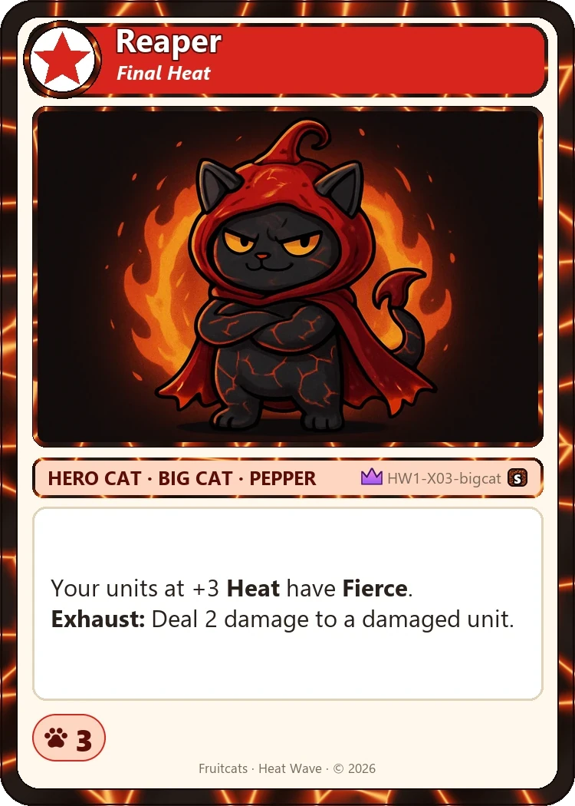
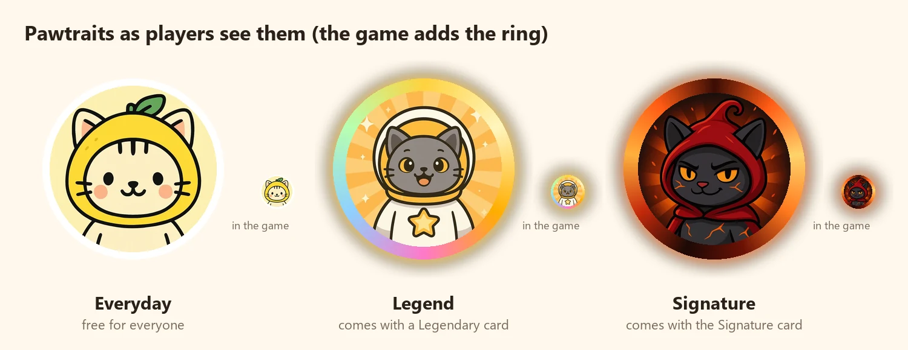
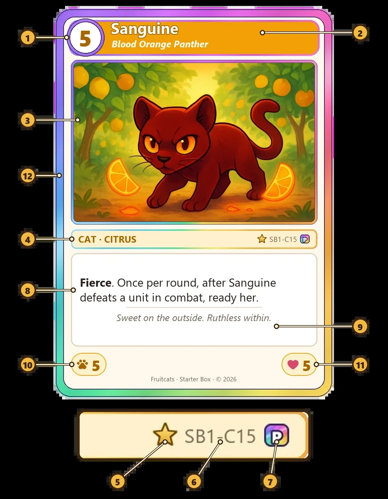
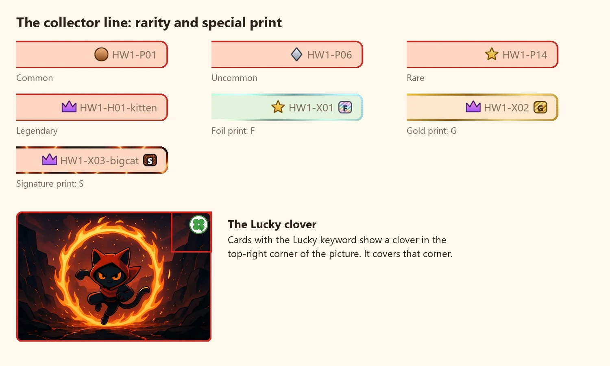
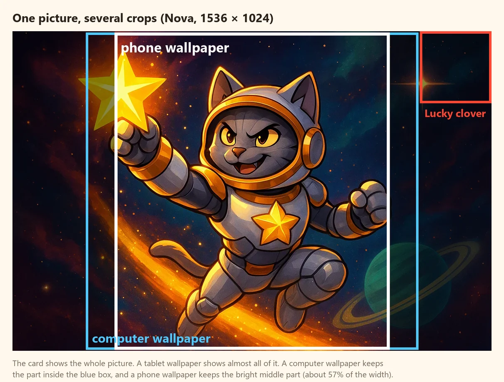
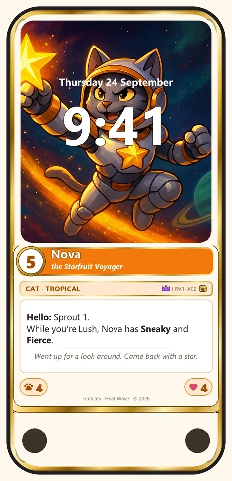

# Fruitcats: a guide for artists

Thank you for agreeing to create art for Fruitcats.

Fruitcats is a card game played on phones, tablets and computers. Its characters are mostly cats wearing
fruit-shaped hoods. You draw the picture on each card; we add the frame, the name and the rules around it.

Last updated 2026-09-24.

## The short version

This is everything you need to start. The rest of the guide explains each point in more detail, so you can
come back to it as questions come up.

### What you'll draw

For each set of cards, we send you an **art brief** that lists every picture the set needs. A typical set has:

- **about 17 card pictures for each new deck:** one for each of the deck's 15 new cards, and two for its
  **Hero Cat**, the deck's main character (a young *Kitten* form and a grown-up *Big Cat* form)
- **a few more card pictures** for cards sold on their own and for tokens (creatures that other cards create
  during a game)
- **one or more Pawtraits:** small square portraits of a character's head, which players use as their profile
  picture. The game shows them in a circle.
- **sometimes one wide picture for the set's announcement**, the web page that tells players about the release

Two pictures in each deck are its **main pictures**: the deck's main character, drawn in two forms. They are
the face of the deck, so they're the place for your strongest work. Cards that players buy on their own are a
chance to show off, too. The brief marks all of these.

### Sizes and files

| Picture | Size (pixels) | Shape | File |
|---|---|---|---|
| Card picture (including Hero Cats and tokens) | 1536 × 1024 | landscape | WebP, named as in the brief (for example `HW1-P07.webp`) |
| Pawtrait | 512 × 512 | square, shown as a circle | WebP, named as in the brief (for example `legend-reaper.webp`) |
| Announcement picture | 2400 × 1260 | wide | WebP, `key-art.webp` |

The game needs two things to work: **these sizes and shapes, and the file names from the brief**. Everything
else is your choice, and this guide explains what has worked well so far.

### How we work together

You work in the **Artist Studio**, a website that takes you through the set one step at a time:

1. Open the Studio at <https://fruitcats.viamochi.com/studio.html>. Sign in, or create a Via Mochi account. While sign-up is by invitation, we
   send you a sign-up code to use.
2. We add you to your set's project. From then on it opens whenever you sign in.
3. Follow the steps. Each one shows what to draw, and when you upload a picture you see it on the real card,
   small in the game and as a wallpaper. We comment on each picture, and the next step opens once we agree.

The steps start with the cards sold on their own, one at a time, then the deck's two main pictures, then the
rest of the deck in small batches, with Pawtraits and the announcement picture last. See
[Milestones](#milestones) for the details.

### Your ideas come first

You're a collaborator. Everything in the brief is a suggestion: the story, the names, the scenes, even what a card
does. If you want to draw something else, go for it, and we'll change the card to fit your picture. See
[Suggesting changes](#suggesting-changes).

### One request

Please **sign the deck's two main pictures in a corner**, the way a painter signs a painting. Signatures on your
other pictures are welcome too.

### Where to find more

- [About Fruitcats](#about-fruitcats) and [the art brief](#the-art-brief)
- [Card tiers](#card-tiers): which cards are sold on their own, and what has worked well for them
- [Two styles](#two-styles): painted scenes, and plush stickers for Hero Cats
- [Pawtraits](#pawtraits-avatars)
- [How your picture is used](#how-your-picture-is-used): on the card, small in the game, and as a wallpaper
- [Your signature](#your-signature)
- [Milestones](#milestones) and [suggesting changes](#suggesting-changes)
- [Style notes](#style-notes), [file formats](#sizes-and-file-formats-for-reference) and the [FAQ](#faq)
- A [checklist](#checklist) at the end, to use while you work

---

## About Fruitcats

Cards come in sets. A set is a group of new cards released together. Players get most cards in a deck, a
ready-made pack of 50 cards. Some cards are also sold one at a time.

How a card is made:

1. We design the card: its name, what it does in the game and its price.
2. You draw its picture.
3. We put your picture on the card. Our software adds the frame, the name, the numbers and the rules text.

*A finished card. The picture in the middle is the artist's work. The rest is added by our software.*

Fruitcats is played by teens and adults, and by some younger players too. Action, danger, fantasy weapons and
dark or spooky moods all fit. Gore and graphic violence don't.

## The art brief

For each picture, the brief tells you:

- the file name
- the size
- what to draw
- the things we had in mind for it (for example, "we imagined a hairless cat")
- whether the card is an ordinary card or one people buy on its own (see [Card tiers](#card-tiers))
- which milestone the picture belongs to

All of it is a starting point. If you have a better idea, go for it, and we'll change the card to fit your
picture (see [Suggesting changes](#suggesting-changes)).

The brief also marks the pictures that come in more than one piece:

- **Hero Cats** have two pictures, one for each form (Kitten and Big Cat).
- **Some cards come with a Pawtrait.** See [Pawtraits](#pawtraits-avatars).
- **Tokens** are listed with the other cards. A token is a creature that appears in the game when another card
  creates it.

## Card tiers

Cards are sold in different ways. The ones people buy on their own are a chance to show off.

We decide each card's kind (a deck card, a Foil, Gold or Signature card, and so on) when we design the card, and
we may change our minds while we design it. By the time a project reaches you in the Studio, that's settled: the
Studio shows your image in exactly the frame the card will have.

| Kind of card | How it's sold | How it looks in the game | What we hope for |
|---|---|---|---|
| **Deck card** | Inside a deck of 50 cards. The deck costs $9.99. | A frame in the colours of the card's family | A clear, fun picture in the set's style |
| **Token** | Not sold. Another card creates it during a game. | A frame in the colours of the card's family | Like a deck card. If a card sold on its own creates it, it's worth the same care. |
| **Foil card** | Sold on its own for $1.49 | A shiny silver frame | A picture people want to show off (see below) |
| **Gold card** | Sold on its own for $4.99 | A gold frame | The same, a step richer |
| **Signature card** | Sold on its own for $19.99. A set has one at most. | A black stone frame with glowing cracks | The set's centrepiece. When it's a Hero Cat, in both of its pictures (Kitten and Big Cat). |

People who buy a card on its own get something they'd like to keep and show to friends, so these are the cards
to go all out on. We call this **showcase art**. Things that have worked well for us:

- the character's face easy to see
- a confident, heroic pose
- dramatic light, like a glow behind the character
- rich detail: clothes, a full background, sparks or snow

These are ideas, not rules. A quiet, funny or unexpected picture can be just as special.

Compare the Heat Wave cards: an ordinary deck card, then a Foil card (Jack), a Gold card (Nova) and the
Signature card (Reaper).

   

### One picture per card

You make one picture per card. (A Hero Cat needs two, because it has two forms: Kitten and Big Cat.) The card's
frame is part of its design, decided before the project reaches you, so you never make a picture per frame. A few
cards, such as the Paragon family's, let you pick the frame's colour in the Studio, to suit your picture.

## Two styles

Fruitcats has two drawing styles. The brief says which one each card uses. A set can also follow the style of the artist who draws it; the brief says so, and then
the artist's own style comes first.

### 1. Painted scenes: every card except Hero Cats

A character in its world, like an illustration from a storybook or an animated film:

- bold, clean outlines and cel shading (flat shadow shapes, not soft airbrushing)
- vibrant, saturated colours
- usually one main character, with its whole body in the picture
- a painted background scene: the family's world (see [Families](#families))
- animals and cats with personality, many of them wearing or shaped like their fruit

### 2. Plush stickers: Hero Cats and Pawtraits

Hero Cats are drawn in a different style from the other cards: they look like **plush toys, drawn as flat
stickers**:

- one chunky, rounded cat with **thick clean black outlines**
- **flat colours**, with almost no shading or fur texture; toy-like rather than realistic
- a simple body with stubby little legs, small paws and a short tail
- a **soft fruit-shaped hood** over its head and back, with its two ears poking out through the hood
- one character, facing the viewer, with its whole body in the picture
- a **plain backdrop**, not a scene: a single soft colour with a few simple doodles (sparkles, fruit slices,
  flames) in the family's theme

A Hero Cat has two forms. Draw them so they clearly look like the same character:

- **Kitten:** smaller, sitting or playful
- **Big Cat:** the same character grown up: bigger, bolder, a power pose

In cute sets, the face is minimal and sewn-on: tiny dot eyes, a small smile, pink blush cheeks, three stripes on
the forehead, long straight whiskers. In "cool" sets (like Heat Wave), it has attitude instead: narrowed eyes, one
raised eyebrow, a cocky half-smile, no blush.

A **Signature** Hero Cat has kept the sticker style and gone further, for example with a glowing halo behind it,
costume details (Reaper has a cape and glowing ember cracks), stronger contrast and a commanding pose.

### Families

Every card belongs to a **family**, and each family has its own background world and frame colours. The frame
colours are added by us, and backgrounds from the same world help a family feel like one place. Families so far:

| Family | Background world (painted scenes) |
|---|---|
| Citrus | a sunny Mediterranean citrus grove, warm yellow and orange light |
| Orchard | a cosy autumn apple orchard, golden afternoon light |
| Garden | a fresh cottage vegetable garden, leafy greens, flowers, morning light |
| Berry | a lush berry patch, pinks, reds and purples |
| Tropical | a tropical jungle clearing, palm leaves, a golden sunset |
| Melon | a lazy summer melon patch, soft greens and pinks |
| Pepper *(Heat Wave)* | a volcanic canyon at dusk, dark basalt, glowing cracks, drifting embers, smoky red-orange sky |

A set can give a family a new look for its own cards: Heat Wave's Garden cards are set in a moonlit Halloween
pumpkin patch. **A new family brings its own background world and three frame colours**, and the brief lists them.

### Each set has a tone

The brief gives the set's tone. The Starter Box is **cute**: sunbeams, hugs, beach days, big sparkly eyes. Heat
Wave is aimed at teens and is **"cool, not cute"**: confident smirks, narrowed eyes, action poses, low camera
angles, a darker palette (charcoal, crimson, ember orange) with fire, sparks and smoke. Streetwear, ninja scarves
and armour are fine.

## Pawtraits (avatars)

Some cards come with a **Pawtrait**: a round profile picture that players get when they own the card. A
Pawtrait is a **Legend Pawtrait** if it comes with a Legendary card. The brief marks which cards need one.

| | Spec |
|---|---|
| Shown as | a **circle**: the square's corners are cut off, and the ring covers a thin band around the edge |
| Framing | **head and shoulders**, face large and centred, filling most of the frame, facing the viewer |
| Style | the **plush sticker style**: bold clean outlines, flat bright colours, a touch of glossy highlight |
| Face | simple and appealing: big round shiny eyes, a happy smile, round pink cheeks (a cool character can smirk, like Reaper) |
| Background (Legend) | a radiant **golden sunburst** with a few big simple four-pointed sparkles. The Signature card's Pawtrait can use its own backdrop: Reaper's is molten ember-orange on black. |
| Background (everyday) | one flat pastel colour, nothing else |
| The ring | The game adds a rainbow-gold ring to Legend Pawtraits, and a ring of molten lava to the Signature card's Pawtrait. A ring drawn into the picture would show inside it. |

*How players see Pawtraits. The ring is added by the game. The small ones show the size in a game.*

Players will expect it to be **the same character as the card**, drawn simpler, because it's shown as small as a
thumbnail.

**What hasn't worked for Pawtraits so far:**

- busy, detailed, hairy or painterly: no fur strands, no wrinkles, no fine patterns
- scary or menacing faces: at icon size they just look unfriendly
- **crown badges or crowns** of any kind
- text, borders or a drawn frame

## How your picture is used

The same picture appears in several places, and each place shows it a little differently. Composition is
your choice. This section explains what happens to the picture in each place, so you can decide what works
for each card.

### On the card

The card shows your whole picture, shrunk to fit a window near the top of the card. Nothing is cut off, but:

- the window has rounded corners and a thin border, which cover a few pixels at the edges
- a few cards have the **Lucky** keyword. They show a small four-leaf clover in the top-right corner of the
  picture, which covers that corner.

Everything around the picture is added by us: the cost, the name, the rules, the numbers, the frame and a
few small badges. You don't need to draw any of them, and a frame drawn into the picture would show inside
ours. The badges show the card's rarity (how rare it is) and, on special versions, a letter for the version:
F for Foil, G for Gold, S for Signature.

*The parts of a card. Only part 3, the picture, is drawn by the artist.*

*The small badges we add. None of them cover the picture, except the Lucky clover.*

### Small, in the game

During a game, cards are often shown small: in a player's hand, or on the table. At that size, fine detail
disappears. What remains visible is the character's outline, its face, and the contrast between the
character and the background. A picture with one clear character is easy to recognise at that size. A busy
scene with several small figures is harder to read.

### As a wallpaper

Players can turn any card they own into a wallpaper for their phone, tablet or computer. The whole screen
becomes the card: the picture fills the top of the screen (on a computer, the left side), and the card's
name and rules are shown below it (on a computer, beside it). Special versions keep their frame.

The screen's shape is different from the picture's shape, so the picture is enlarged to fill the space, and
the sides are cut off:

- **Phone:** only the middle part is kept, about 57% of the width, at full height.
- **Tablet:** almost the whole picture is kept.
- **Computer:** the middle part is kept, about 70% of the width.
- **Phone lock screen:** the clock and the date sit over the upper middle part of the picture. Their exact
  size and position depend on the phone and the player's settings.

*An example picture (Nova). The phone wallpaper keeps only the part inside the white box. The star in her
hand is partly cut off.*

*Nova as a phone wallpaper, approximately, with the clock on top.*

What this means for your picture:

- Things near the left and right edges are cut off on a phone wallpaper.
- A face right under the clock may be partly hidden on a phone lock screen.
- A picture whose main character sits in the middle of the width works well on every screen.

We don't design the cards around wallpapers: the card comes first. But players are most likely to make
wallpapers from the cards they paid for, so for **Foil, Gold and Signature cards** it's worth checking how the
middle of your picture looks on its own.

## Your signature

**Please sign each deck's two main pictures**, in a corner, the way a painter signs a painting. The main
pictures are the two forms of the deck's main character, its Hero Cat (Kitten and Big Cat). The brief marks them.

You're welcome to sign your other pictures too, and we especially encourage it on the paid cards and on the
set's Signature card.

A few things affect where a signature stays visible:

- On the card, the border covers about the outer 15 pixels of the picture, and on Lucky cards the clover covers
  the top-right corner.
- On a phone wallpaper, the left and right sides of the picture are cut off (see [As a wallpaper](#as-a-wallpaper)).
- The picture is shrunk to less than half its size on the card, so a very small signature may be hard to read.

A bottom corner, a little in from the edge, stays visible on the card. A corner signature is cut off on a
phone wallpaper, which is fine: the card is what matters.

## Style notes

- **Keep each character the same on every card it appears on.** For example, Blaze, the Heat Wave Hero Cat,
  also appears on the Showdown and Ring of Fire cards.
- **Make the fruit easy to recognise.** For example, a chili is long, curved and pointed. A round red hood
  looks like a tomato.
- **The house style is drawn, not photographic.** Photo-realism and a 3D-render look don't match the other cards.
- **Make it your own.** We can't publish characters or art copied from other games.
- **Ask when a description is unclear.**

## Milestones

We check the work at several points, so that a problem shows up after one or two pictures, not after the
whole set. The brief gives the order and a date for each milestone.

1. **The cards sold on their own, one at a time.** Each set has three: a Foil card, a Gold card and the
   Signature card. They don't depend on the deck, so they're a good place to start. For each one, send a sketch
   first, then the finished picture. We put it on the real card and send you previews: on the card, small in
   the game and as a wallpaper. This is also where we check the sizes and file names. We reply before you move
   on to the next card, so each card teaches us both something about the next.
2. **The deck's two main pictures.** Its Hero Cat, as a Kitten and as a Big Cat, signed in a corner. They are
   the face of the deck and the main reason people buy it, so we want them to be excellent. Sketch first, then
   finish.
3. **The rest of the deck, in batches.** A few pictures at a time, for example four or five. Send a sketch or a
   finished picture, whichever suits you; we reply to each batch before you go far with the next one.
4. **Pawtraits.** Draw a character's Pawtrait after its card picture is agreed, so the two match.
5. **The announcement picture**, if the brief asks for one.
6. **Final check.** We send you previews of every finished card before anything goes public.

The first pictures matter most. We may go back and forth a few times on them. If, after that, they aren't where
we both want them, this is the point where we would stop, before you've put time into the rest of the set.

Upload each picture in the Studio, which keeps every version. If the Studio isn't working for you, an email, a
zip or a shared folder is fine too. Then please use the file names from the brief exactly, because our tools
find each picture by its name. Capitals and dashes matter:
`HW1-P07.webp`, not `hw1_p07.webp` or `Scotch Bonnet Rhino.webp`.

## Suggesting changes

You're a collaborator, not someone filling in our spec. The art is the most important part of Fruitcats, and
everything we wrote is a suggestion: the story, the names, the titles, the scenes, even what a card does. We
designed the cards before anyone drew them, so a lot of it is just what we picked first.

If you want to draw something else, go for it. Tell us your idea, with a sketch or on its own, and we'll change
the card's name, text or rules to fit your picture. Some examples:

- a different animal, fruit or character
- a new name or title
- a different scene, pose or mood
- a card that does something else, because your picture suggests it

The only real requirements are technical: a file we can read, and the picture's size and shape for the card
(see [Sizes and file formats](#sizes-and-file-formats-for-reference)).

## Sizes and file formats (for reference)

The brief gives the size and file name of every picture. This is the same information in one place.

| Picture | Size (pixels) | Shape | File name |
|---|---|---|---|
| Card picture | 1536 × 1024 | landscape, 3:2 | the card's ID: `HW1-P07.webp` |
| Hero Cat, Kitten and Big Cat faces | 1536 × 1024 each | landscape, 3:2 | `HW1-H01-kitten.webp`, `HW1-H01-bigcat.webp` |
| Token | 1536 × 1024 | landscape, 3:2 | the token's ID: `HW1-K01.webp` |
| Pawtrait | 512 × 512 | square, shown as a circle | `legend-<name>.webp`: `legend-reaper.webp` |

- **Format:** WebP, quality 90 or more. If your software can't save WebP, send PNG with the same name and
  we'll convert it.
- **Colour:** sRGB. Fill the whole picture: transparent areas can turn black on the card.
- **Working bigger is fine** (for example 3072 × 2048), as long as you keep the shape and deliver at the size above.
- **Keep your layered files** (PSD, KRA and so on), in case we ask for a small change.
- **On the card,** the picture is shrunk to a 666 × 444 window on a 750 × 1050 card. The border covers about
  15 pixels of each edge of your 1536 × 1024 picture, a little more at the corners. On Lucky cards, the clover
  covers about the top-right 200 × 200 pixels.

## FAQ

**Can I draw bigger than 1536 × 1024?**
Yes, and it's a good idea. Just keep the 3:2 shape and deliver at 1536 × 1024.

**Do I need to write the card's name in the picture?**
No. The name, cost and rules are printed on the card around your picture. Lettering inside the scene, like a
sign or a label, is your call. Keep in mind that small text is hard to read at card size.

**Do I draw the Foil, Gold, Prismatic or Signature versions?**
No. You make each card's picture once. Which frame the card has is decided when we design it, and the Studio shows
your picture in that frame.

**Why does a Hero Cat look so different from the other cards?**
Hero Cats are the decks' mascots, so they share one recognisable look: the flat plush-sticker style.
Everything else is a painted scene.

**Is a paid card's art a different picture from its deck-card version?**
Paid singles are their own cards, not upgrades of a deck card, so there's only one picture per card: one to show
off.

**Do I have to design for wallpapers?**
No. The card comes first. But for the paid cards, it's worth checking that the middle of the picture works on
its own, because that's what a phone wallpaper shows (see [As a wallpaper](#as-a-wallpaper)).

**How cute or how cool?**
The brief gives each set's tone. When unsure, look at that set's finished cards, or at Heat Wave for "cool".

**Can I sign my art?**
Yes, please. We ask for a signature in a corner of each deck's two main pictures, and we especially
encourage it on the paid cards and on the set's Signature card. See
[Your signature](#your-signature) for where a signature stays visible.

**Something in the brief doesn't make sense, or two cards clash.**
Ask, or tell us what you'd rather draw. Anything in the brief can change, including the cards' rules.

**Where can I see a finished example?**
Heat Wave. Its announcement page, <https://fruitcats.viamochi.com/announcements/heat-wave>, shows its cards,
and [its art brief](art-brief-heat-wave.md) lists every card.

---

## Checklist

Use this list while you work, and again before you send your pictures.

**Before you start**

- [ ] I have read the art brief for the set.
- [ ] I know which cards are sold on their own (Foil, Gold, Signature): the ones to show off.
- [ ] I know which cards are Hero Cats (two pictures each, sticker style).
- [ ] I know which cards need a Pawtrait, and which tokens need a picture.
- [ ] I know the set's tone and the background world of each family in it.
- [ ] I know what we had in mind for each card, and where I'd like to do something else.

**Milestones**

- [ ] I did the cards sold on their own one at a time, and got a reply on each before starting the next.
- [ ] I sent the deck's two main pictures, finished and signed, and we agreed on them.
- [ ] I'm sending the rest in batches, and waiting for a reply before going far with the next batch.
- [ ] I told you about anything I wanted to change: names, characters, scenes or what a card does.

**Each final picture**

- [ ] It has the size and the file name from the brief.
- [ ] If I signed it, I checked that the signature stays visible on the card.
- [ ] I checked how it looks at a small size.
- [ ] On Lucky cards, I checked what the clover covers in the top-right corner.

**Paid cards (Foil, Gold, Signature)**

- [ ] It's a picture I'd be proud to have people buy and show off.
- [ ] I checked how the middle of the picture looks on its own, as on a phone wallpaper.

**Hero Cats and Pawtraits**

- [ ] Both Hero Cat pictures (Kitten and Big Cat) clearly show the same character.
- [ ] I signed the deck's two main pictures in a corner.
- [ ] Each Pawtrait matches its card's character and is simple enough to read when small.

**Sending**

- [ ] Every picture in the brief is included.
- [ ] Each character looks the same on every card it appears on, and on its Pawtrait.
